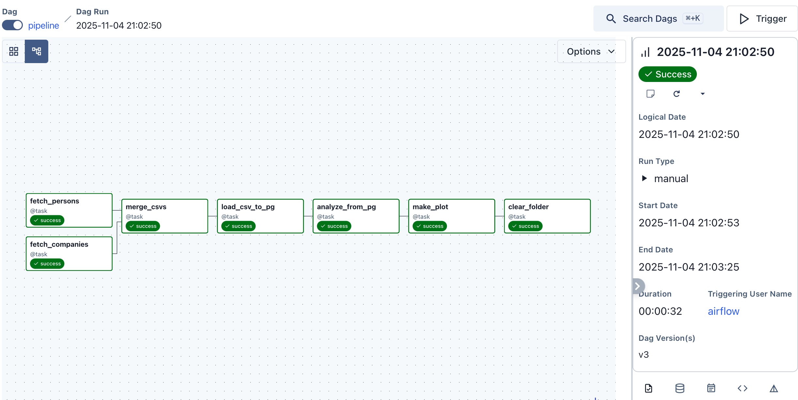

# Data Engineering Assignment 10 – Airflow ETL Pipeline
Data Engineering Assignment 10


# 📌 Project Overview

This project demonstrates deploying Apache Airflow in a development environment and creating an automated ETL pipeline. The pipeline ingests data from multiple sources, performs transformations, merges the datasets, and loads the processed data into a PostgreSQL database. Finally, analytical tasks are performed on the transformed data, including visualization and cleanup of intermediate data.


## 📁 Directory Structure
DATA-ENGINEERING-ASSIGNMENT10/
│
├── .devcontainer/ # Development container config
├── airflow-env/ # Python virtual environment for Airflow
│
├── dags/
│ ├── pipeline.py # Main DAG implementation
│ └── __pycache__/
│
├── data/ # Raw and processed datasets
├── logs/ # Airflow logs
├── pics/ # Visualization output (e.g., Pipeline.png)
├── plugins/ # Custom Airflow plugins (if any)
│
├── airflow.cfg # Airflow configuration
├── requirements.txt # Python dependencies
└── README.md


DAG Graph

Output screenshot saved as /pics/Pipeline.png



# ▶️Instructions to Run

1. Start development container

Create the folders
```
mkdir -p .devcontainer data

touch  .devcontainer/docker-compose.yml .devcontainer/.Dockerfile 

cat <<EOF >> .devcontainer/db.env
POSTGRES_DB=airflow_db
POSTGRES_USER=vscode
POSTGRES_PASSWORD=vscode
EOF

cat <<EOF >> requirements.txt
Faker==37.12.0
apache-airflow-providers-postgres
EOF
```

2. Install dependencies

pip install -r requirements.txt

requirements.txt
```
Faker==37.12.0
apache-airflow-providers-postgres
matplotlib==3.10.1
```

3. Initialize Airflow

airflow db init

4. Start Airflow

airflow scheduler & airflow webserver

5. Access Airflow UI: http://localhost:8080

6. Enable DAG pipeline


### Python Code for Analysis
```python

@task()
    def analyze_from_pg(conn_id: str, table: str = TARGET_TABLE, schema: str = "week8_demo") -> list[tuple[str, int]]:
        """Return top company email domains by employee count."""
        sql = f"""
            SELECT split_part(company_email, '@', 2) AS domain, COUNT(*) AS n
            FROM {schema}.{table}
            WHERE company_email IS NOT NULL AND company_email <> ''
            GROUP BY 1
            ORDER BY n DESC
            LIMIT 10;
        """
        hook = PostgresHook(postgres_conn_id=conn_id)
        with hook.get_conn() as conn, conn.cursor() as cur:
            cur.execute(sql)
            rows = cur.fetchall()
        return rows

    @task()
    def make_plot(top_domains: list[tuple[str, int]], outdir: str = "/opt/airflow/data/plots") -> str:
        """
        Save a simple horizontal bar chart (with value labels) and return its path.
        Uses only matplotlib; no extra deps.
        """
        import os
        import matplotlib.pyplot as plt

        os.makedirs(outdir, exist_ok=True)
        if not top_domains:
            outpath = os.path.join(outdir, "top_domains_hbar.png")
            plt.figure()
            plt.text(0.5, 0.5, "No data", ha="center", va="center")
            plt.savefig(outpath)
            plt.close()
            return outpath

    # unpack domains and counts (already sorted desc by your SQL)
        domains = [d for d, _ in top_domains]
        counts  = [n for _, n in top_domains]

        plt.figure()
        bars = plt.barh(domains, counts)          # horizontal bars
        plt.gca().invert_yaxis()                  # largest at top
        plt.xlabel("Employee count")
        plt.title("Top Company Email Domains")

    # add simple value labels at the end of each bar
        for bar, val in zip(bars, counts):
            x = bar.get_width()
            y = bar.get_y() + bar.get_height() / 2
            plt.text(x, y, f"{val}", va="center", ha="left", fontsize=9)

        plt.tight_layout()
        outpath = os.path.join(outdir, "top_domains_hbar.png")
        plt.savefig(outpath)
        plt.close()
        return outpath

```

📊 Final Output

Merged dataset successfully inserted in PostgreSQL

Data analysis / visualization generated

Intermediate files removed